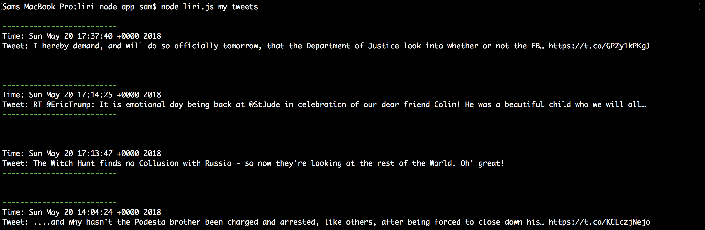
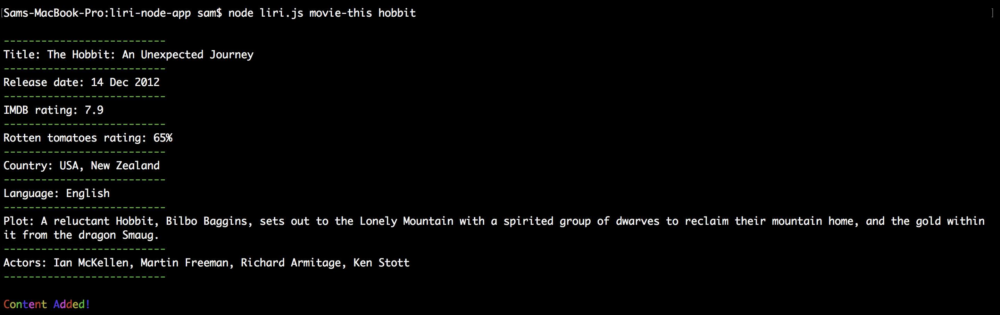
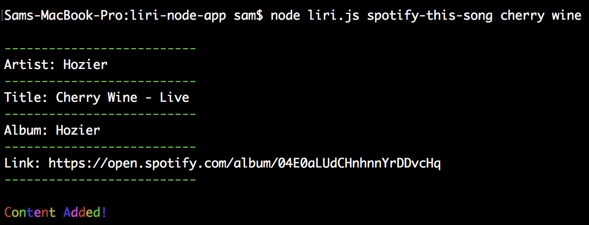

A backend, Siri like terminal app which uses Node, DotEnv, FS and the API's Spotify, Twitter and OMDB to enable user searches for any song, tweet or movie/film.

Feel free to clone and use the app or view images below!

