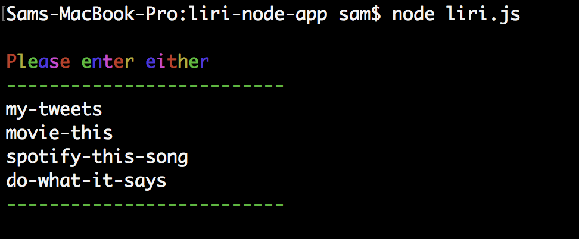
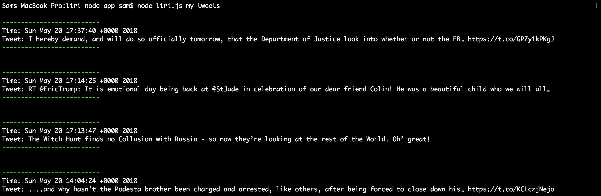
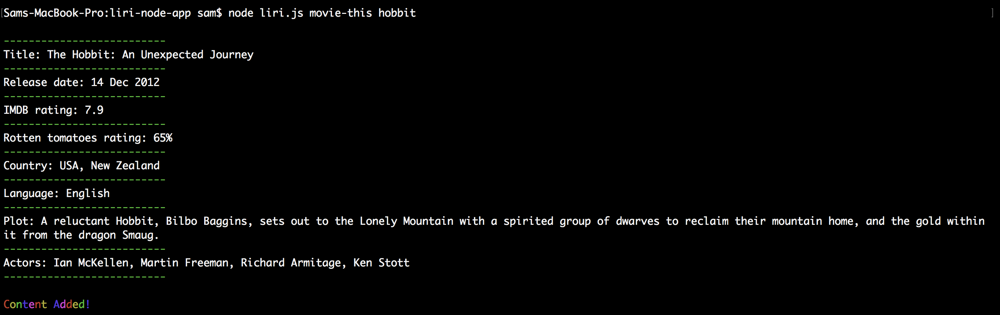
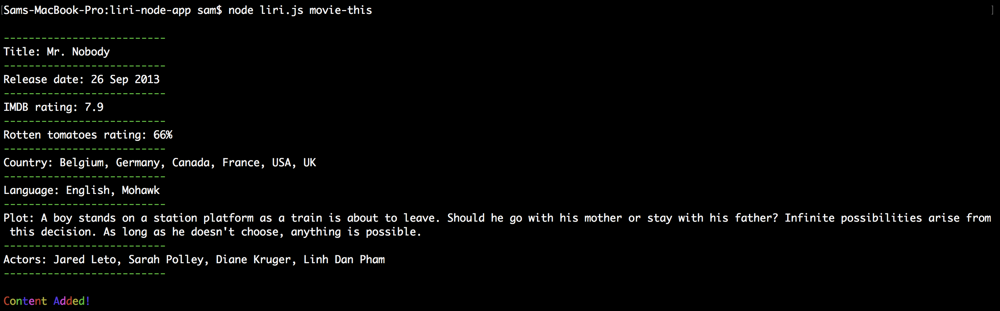
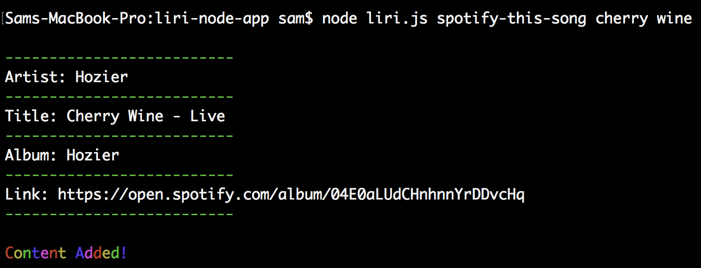
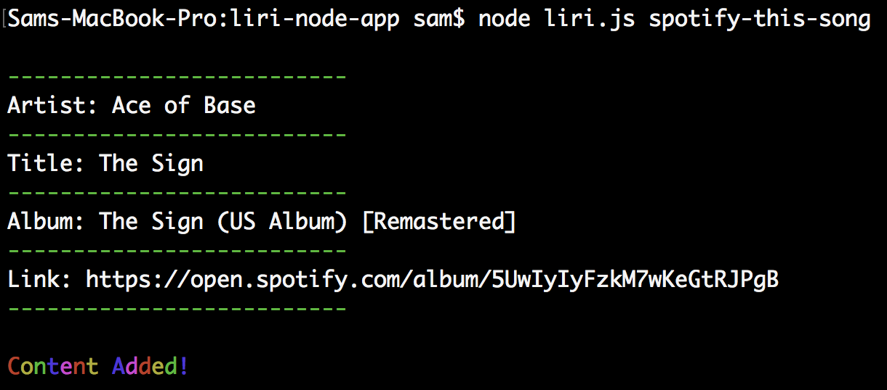

The Liri node app is a backend terminal application that mimicks the functionality of Siri using Node.js, request, DotEnv, and the Twitter, Spotify and OMDB movie API's. 

Feel free to clone my Repo to test, or view the images below!

